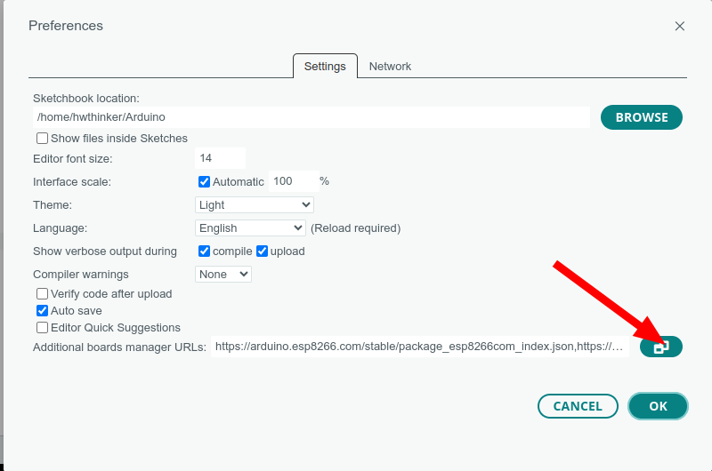

# Modul ESP8266 Relay 4 Channel 30A 


## Cara install plugin Arduino IDE

### Langkah 1: Buka Arduino IDE

1. Buka aplikasi Arduino IDE di komputer Anda. Jika belum ada, unduh dan instal Arduino IDE dari situs resmi Arduino di https://www.arduino.cc/en/software. disarankan menggunakan arduino ide versi 2

### Langkah 2: Tambahkan URL Board Manager untuk ESP8266

2. Di Arduino IDE, buka **File** > **Preferences**.

   

3. Pada bagian  Additional Boards Manager URLs, tambahkan URL berikut:

```
https://arduino.esp8266.com/stable/package_esp8266com_index.json
```

4. Jika sebelumnya Anda sudah memiliki URL lain di sana, pisahkan URL ini dengan tanda koma atau baris baru.


### Langkah 3: Buka Boards Manager

1. Buka **Tools** > **Board** > **Boards Manager**.


2. Di kotak pencarian, ketik **ESP8266**

### Langkah 4: Instal Board ESP8266

1. Temukan **ESP8266 by Espressif Systems** di daftar, kemudian klik **Install**.


2. Tunggu hingga proses instalasi selesai.

### Langkah 5: Pilih Board ESP8266

1. Setelah instalasi selesai, Anda dapat memilih board ESP8266.
2. Buka **Tools** > **Board**, dan gulir ke bawah untuk menemukan berbagai jenis board ESP8266 yang telah diinstal. Pilih board yang sesuai, misalnya **Nodemcu 1.0 (ESP-12E Module)** 


3. hasilnya kurang lebih seperti ini


### Langkah 6: Pilih Port

1. Sambungkan board esp8266 ke komputer Anda menggunakan kabel USB.
2. Di **Tools** > **Port**, pilih port yang sesuai dengan esp8266 Anda.

### Kode program testing relay

```c++
#include <Arduino.h>

// Pin relay
#define RLY1 16
#define RLY2 14
#define RLY3 12
#define RLY4 13

// Pin button
#define BUTTON_PIN 4

// Interval waktu untuk setiap relay (ms)
const unsigned long interval = 500; // 500 ms
unsigned long previousMillis = 0;
unsigned long lastDebounceTime = 0;
const unsigned long debounceDelay = 50; // debounce 50ms

// Variabel untuk melacak relay yang aktif
int currentRelay = 0;

// Array pin relay
int relayPins[] = {RLY1, RLY2, RLY3, RLY4};
const int numRelays = sizeof(relayPins) / sizeof(relayPins[0]);

// Status tombol sebelumnya
int lastButtonState = HIGH;
bool buttonPressed = false;

void setup() {
  Serial.begin(115200);
  Serial.println("\nESP8266 GPIO Input & Relay Test");
  
  // Setup pin button
  pinMode(BUTTON_PIN, INPUT_PULLUP);
  
  // Konfigurasi pin relay sebagai output
  for (int i = 0; i < numRelays; i++) {
    pinMode(relayPins[i], OUTPUT);
    digitalWrite(relayPins[i], LOW); // Awalnya semua relay mati
  }
}

void loop() {
  unsigned long currentMillis = millis();
  
  // Baca status tombol dengan debouncing
  int buttonState = digitalRead(BUTTON_PIN);
  
  // Cek jika tombol berubah status
  if (buttonState != lastButtonState) {
    lastDebounceTime = currentMillis;
  }
  
  // Debouncing dan deteksi tekan tombol
  if ((currentMillis - lastDebounceTime) > debounceDelay) {
    if (buttonState == LOW && !buttonPressed) {
      Serial.println("Tombol GPIO4 ditekan");
      buttonPressed = true;
    } else if (buttonState == HIGH) {
      buttonPressed = false;
    }
  }
  
  // Update status tombol terakhir
  lastButtonState = buttonState;
  
  // Kontrol relay berdasarkan interval
  if (currentMillis - previousMillis >= interval) {
    previousMillis = currentMillis;
    
    // Matikan semua relay
    for (int i = 0; i < numRelays; i++) {
      digitalWrite(relayPins[i], LOW);
    }
    
    // Aktifkan relay saat ini
    digitalWrite(relayPins[currentRelay], HIGH);
    
    // Pindah ke relay berikutnya
    currentRelay = (currentRelay + 1) % numRelays;
  }
}
```


## Aktivasi relay

Default relay tidak terhubung ke ESP8266. Agar relay terhubung ke esp8266 pastikan memasang jumper  antara relay dengan GPIO dengan ketentuan:

- RLY1 ke IO16
- RLY2 ke IO14
- RLY3 ke IO12
- RLY 4 ke IO13


## Cara Upload dengan Serial USB biasa

.jpg)

- Pasang serial USB TTL dengan ketentuan: 
   - TX  board-> RX USB Serial (Kabel Putih)
   - RX Board -> TX USB Serial (Kabel Hijau)
   - GND -> GND USB Serial (Kabel Hitam)
- Pasang Jumper untuk menghubungkan GPIO dan GND
- Pastikan supply DC 12VDC  dihubungkan dengan ketentuan
   - Hubungkan Terminal block pin dengan label 7-28V dengan kutub positif Powersupply
   - Hubungkan Terminal block GND  dihubungkan dengan GND Powersupply

- klik (tekan dan lepas) tombol RST 
- Upload program dan tunggu sampai selesai
- Lepaskan jumper yang menghubungkan GPIO dan  GND
- klik tombol RST untuk run-program (langkah ini penting agar firmware baru dijalankan)
- ulang langkah awal bila melakukan download ulang lagi

## Cara Upload dengan Serial USB Auto Download


- Pasang serial USB TTL dengan ketentuan:
    - RX -> RX USB Serial  
    - TX -> TX USB Serial 
    - GND -> GND USB Serial  
    - IO0 -> IO# USB Serial 
    - EN -> EN# USB Serial
- Pastikan supply DC 12VDC  dihubungkan Terminal block pin dengan label 7-28V
- Pastikan GND supply dihubungkan dengan GND 
- Upload program dan tunggu sampai selesai


## Warning:❗⚠️
Aktifkan daya untuk menghidupkan alat hanya dengan satu jenis sumber daya, bisa 12VDC atau 5VDC. Jangan menghubungkan beberapa sumber daya secara bersamaan, karena akan menyebabkan kerusakan pada alat.

> [!NOTE]
> Untuk serial disarankan menggunakan serial auto download
>
> - https://tokopedia.link/Ml3NIixX6Mb atau
> - https://shopee.co.id/product/21375728/27056587756/ 